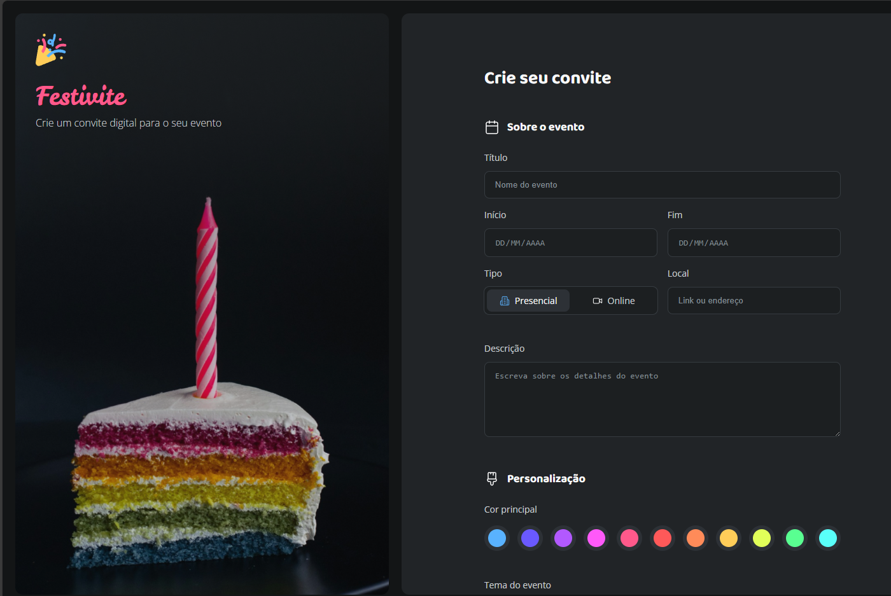

# Festivite - Criador de Convites Digitais 🎉

## 💻 Sobre o Projeto
O **Festivite** é um projeto desenvolvido para aprimorar conhecimentos em formulários HTML e suas funcionalidades. O objetivo principal foi criar uma interface intuitiva para geração de convites digitais, explorando diferentes tipos de inputs, validações e estilizações.



## 🛠 Tecnologias Utilizadas
- **HTML5**
- **CSS3** (com variáveis e regras aninhadas)
- **JavaScript vanilla**
- **Google Fonts** (Baloo 2, Leckerli One, Open Sans)

## ⚙️ Funcionalidades Implementadas
### 📌 Formulário Principal
- Campos para informações do evento (título, datas, local, descrição)
- Seleção de tipo de evento (presencial/online)
- Personalização visual (cores, temas, modo claro/escuro)
- Upload de imagem de capa
- Dados de contato do organizador

### ✅ Validações
- Campos obrigatórios
- Formatação automática de telefone
- Validação de e-mail
- Feedback visual de erros
- Mensagens de erro personalizadas

### 🎨 Estilização
- Interface moderna e intuitiva
- Paleta de cores personalizável
- Temas pré-definidos para diferentes tipos de eventos
- Switch para alternar entre modo claro/escuro

## 📚 Aprendizados
Este projeto permitiu explorar diversos conceitos importantes de formulários HTML:
- Diferentes tipos de inputs (`text`, `date`, `radio`, `checkbox`, `file`)
- Estilização personalizada de inputs
- Validação de formulários com JavaScript
- Feedback visual para o usuário
- Manipulação de eventos
- Máscaras de input
- Upload de arquivos
- Organização de CSS com componentes
- Uso de variáveis CSS para temas

### 📁 Estrutura do Projeto

```festivite/
├── assets/
│   ├── icons/
├── styles/
│   ├── index.css
│   ├── global.css
│   ├── layout.css
│   ├── forms.css
│   ├── footer.css
│   └── fields/
│       ├── about-event.css
│       ├── customization.css
│       └── contact.css
├── js/
│   └── index.js
└── index.html

